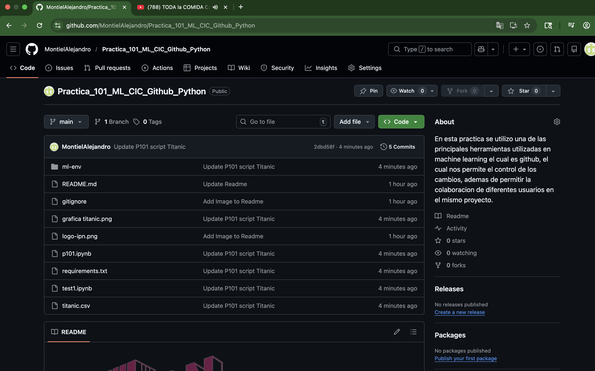
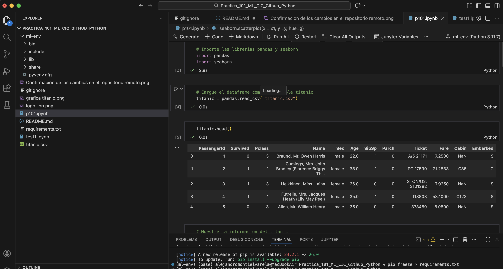
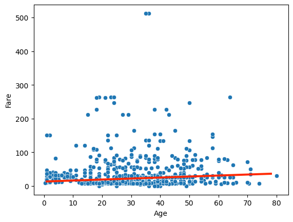

# Instituto Politecnico Nacional
# Centro de Investigacion en Computo CIC
# Departamento de Diplomados y Extension Profesional
# Practica_101_ML_CIC_Github_Python
## Curso Machine Learning 
## Alumno: Alejandro Montiel 
## Profesor: Alan Badillo Salas 

## Introduccion 

En esta practica se utilizo una de las principales herramientas utilizadas en machine learning el cual es github, el cual nos permite el control de los cambios, ademas de permitir la colaboracion de diferentes usuarios en el mismo proyecto de forma controlada y de manera mas eficaz.  

En una primera etapa se creo un repositorio en github para el proyecto de viusualizacion y graficacion de datos de un dataframe en este caso titanic.

Una vez creado el repositorio, se clono este repositorio en nuestra maquina local mediante Github Desktop. Una vez creado el repositorio el cual es publico. Se creo un ambiene virtual en el cual contiene las versiones de las librerias a utilizar para este proyecto para en un futuro poder saber cuales eran los requerimientos utilizados para la ejecucion del programa. 

Una ve creado el ambiente virtual se modificaron los archivos readme y se procedio a la realizacion de la practica el cual consistia en:

- Crear un archivo de base python llamado p0101 
- Desargar y leer el dataframe de titanic.
- Manipulacion del dataframe.
- Ploteo de algunas variables del dataframe y crear una curva que mejor se aproxime a todos los puntos 

Una vez realizado el programa se procede a confirmar todos los datos en el repositorio origen mediante github desktop. 

## Resultados 

- Creacion del repositorio y contenido en Github 

- Datos del dataframe titanic

- Grafica entre la variable informativa y variable de respuesta. Ajuste de la curva 

###### Febrero, 2026. 